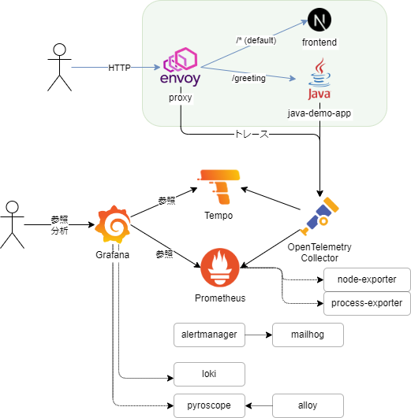

O11y(Observabilitry) Introduction
===================================


構成



ディレクトリ構成

```text
.
├── README.md
├── config                 // Grafana/Prom等の設定ファイル群
├── docker-compose.yaml
├── envoyproxy             // L7LB役のEnvoy
├── frontend               // リクエストを飛ばす役目の画面。Next.js
├── java-demo-app          // 計装する対象のアプリ
├── provisioning           // Grafanaのダッシュボード・データソースの定義
└── 構成.drawio.png
```
